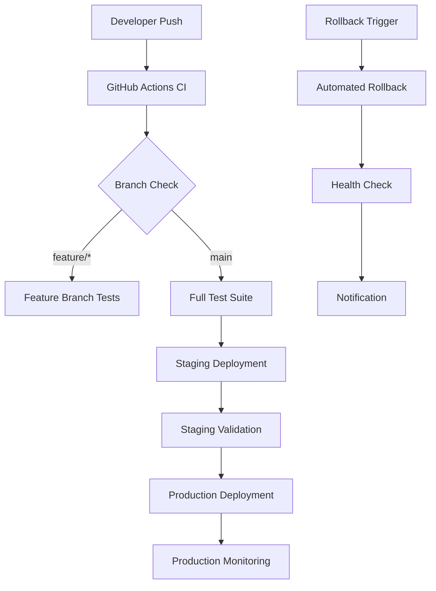

# 🚀 FADDL Match Deployment Automation & Rollback Playbook

**Version:** 1.0  
**Last Updated:** 2025-08-03  
**Environment Coverage:** Development, Staging, Production  

---

## 📋 Quick Reference Guide

### Emergency Contacts
```yaml
DevOps Team: emergency-devops@faddlmatch.com
Security Team: security@faddlmatch.com
Platform Lead: platform@faddlmatch.com
Islamic Compliance: compliance@faddlmatch.com
```

### Critical Service URLs
```yaml
Production: https://faddlmatch.com
Staging: https://staging.faddlmatch.com
Monitoring: https://monitoring.faddlmatch.com
Status Page: https://status.faddlmatch.com
```

---

## 🏗️ Deployment Architecture Overview

### Multi-Environment Strategy


### Infrastructure Components
```yaml
Frontend:
  Platform: Netlify
  Framework: Next.js 15.1.2
  Build: Node.js 18.x
  CDN: Global Edge Network

Backend:
  Database: Supabase PostgreSQL
  Edge Functions: Supabase (Deno runtime)
  Auth: Clerk + Supabase
  Real-time: Supabase Realtime

Monitoring:
  Performance: Lighthouse CI
  Errors: Sentry
  Uptime: Custom monitoring
  Logs: Supabase logs + Netlify logs
```

---

## 🔄 Automated Deployment Procedures

### 1. Standard Deployment Flow

#### Pre-Deployment Validation
```bash
#!/bin/bash
# Pre-deployment validation script

set -e

echo "🔍 Starting pre-deployment validation..."

# 1. Check environment variables
validate_env_vars() {
    required_vars=(
        "NEXT_PUBLIC_SUPABASE_URL"
        "NEXT_PUBLIC_SUPABASE_ANON_KEY"
        "NEXT_PUBLIC_CLERK_PUBLISHABLE_KEY"
        "CLERK_SECRET_KEY"
    )
    
    for var in "${required_vars[@]}"; do
        if [[ -z "${!var}" ]]; then
            echo "❌ Missing required environment variable: $var"
            exit 1
        fi
    done
    echo "✅ Environment variables validated"
}

# 2. Dependency security check
security_check() {
    echo "🛡️ Running security checks..."
    npm audit --audit-level high
    if [ $? -ne 0 ]; then
        echo "❌ Security vulnerabilities found"
        exit 1
    fi
    echo "✅ Security check passed"
}

# 3. Build validation
build_check() {
    echo "🔨 Validating build..."
    npm run build
    if [ $? -ne 0 ]; then
        echo "❌ Build failed"
        exit 1
    fi
    echo "✅ Build successful"
}

# 4. Islamic compliance check
compliance_check() {
    echo "🕌 Running Islamic compliance validation..."
    if grep -r "haram\|inappropriate\|non-halal" apps/web/src/ --exclude-dir=node_modules; then
        echo "❌ Islamic compliance issues found"
        exit 1
    fi
    echo "✅ Islamic compliance validated"
}

# Execute validation steps
validate_env_vars
security_check
build_check
compliance_check

echo "🎉 Pre-deployment validation completed successfully"
```

#### Deployment Execution
```yaml
# GitHub Actions Deployment Flow
name: Production Deployment
on:
  push:
    branches: [main]
    
jobs:
  validate-and-deploy:
    runs-on: ubuntu-latest
    environment: production
    
    steps:
    - name: Checkout code
      uses: actions/checkout@v4
    
    - name: Setup Node.js
      uses: actions/setup-node@v4
      with:
        node-version: '18'
        cache: 'npm'
    
    - name: Install dependencies
      run: |
        cd apps/web
        npm ci --legacy-peer-deps
    
    - name: Run pre-deployment validation
      run: ./scripts/pre-deployment-validation.sh
    
    - name: Build application
      run: |
        cd apps/web
        npm run build
      env:
        NEXT_PUBLIC_SUPABASE_URL: ${{ secrets.SUPABASE_PROD_URL }}
        NEXT_PUBLIC_SUPABASE_ANON_KEY: ${{ secrets.SUPABASE_PROD_ANON_KEY }}
        NEXT_PUBLIC_CLERK_PUBLISHABLE_KEY: ${{ secrets.CLERK_PROD_KEY }}
    
    - name: Deploy to production
      run: |
        cd apps/web
        npx netlify deploy --prod --dir=.next
      env:
        NETLIFY_AUTH_TOKEN: ${{ secrets.NETLIFY_AUTH_TOKEN }}
        NETLIFY_SITE_ID: ${{ secrets.NETLIFY_PROD_SITE_ID }}
    
    - name: Run post-deployment validation
      run: ./scripts/post-deployment-validation.sh
```

### 2. Zero-Downtime Deployment Strategy

#### Blue-Green Deployment Simulation
```bash
#!/bin/bash
# Zero-downtime deployment with health checks

DEPLOYMENT_URL=""
HEALTH_CHECK_ENDPOINT="/api/health"
MAX_RETRIES=30
RETRY_INTERVAL=10

deploy_and_validate() {
    echo "🚀 Starting zero-downtime deployment..."
    
    # Deploy to new instance
    DEPLOYMENT_URL=$(npx netlify deploy --dir=.next --json | jq -r '.deploy_url')
    
    if [[ -z "$DEPLOYMENT_URL" ]]; then
        echo "❌ Deployment failed - no URL returned"
        exit 1
    fi
    
    echo "📍 Deployment URL: $DEPLOYMENT_URL"
    
    # Health check loop
    for i in $(seq 1 $MAX_RETRIES); do
        echo "🔍 Health check attempt $i/$MAX_RETRIES..."
        
        if curl -sf "$DEPLOYMENT_URL$HEALTH_CHECK_ENDPOINT" > /dev/null; then
            echo "✅ Health check passed"
            break
        fi
        
        if [ $i -eq $MAX_RETRIES ]; then
            echo "❌ Health check failed after $MAX_RETRIES attempts"
            rollback_deployment
            exit 1
        fi
        
        sleep $RETRY_INTERVAL
    done
    
    # Promote to production
    echo "🎯 Promoting deployment to production..."
    npx netlify deploy --prod --dir=.next
    
    # Final validation
    validate_production_deployment
}

validate_production_deployment() {
    echo "🔍 Validating production deployment..."
    
    # Test critical endpoints
    critical_endpoints=(
        "/"
        "/api/health"
        "/matches"
        "/profile"
    )
    
    for endpoint in "${critical_endpoints[@]}"; do
        if ! curl -sf "https://faddlmatch.com$endpoint" > /dev/null; then
            echo "❌ Critical endpoint failed: $endpoint"
            rollback_deployment
            exit 1
        fi
    done
    
    echo "✅ Production deployment validated successfully"
}
```

---

## ⏪ Automated Rollback Procedures

### 1. Emergency Rollback Triggers

#### Automated Rollback Conditions
```yaml
Trigger Conditions:
  Performance Degradation:
    - Response time > 5 seconds (95th percentile)
    - Error rate > 5%
    - Failed health checks for > 2 minutes
  
  Security Issues:
    - Security alert triggered
    - Unauthorized access detected
    - Data integrity concerns
  
  Functional Issues:
    - Critical feature failure
    - Database connection issues
    - Authentication system failure
  
  Islamic Compliance:
    - Content validation failures
    - Cultural sensitivity violations
    - Guardian system malfunctions
```

#### Rollback Decision Matrix
```bash
#!/bin/bash
# Automated rollback decision engine

check_rollback_conditions() {
    local rollback_required=false
    
    # Performance checks
    response_time=$(curl -w "%{time_total}" -s -o /dev/null https://faddlmatch.com)
    if (( $(echo "$response_time > 5.0" | bc -l) )); then
        echo "⚠️ Performance degradation detected: ${response_time}s response time"
        rollback_required=true
    fi
    
    # Error rate check
    error_rate=$(curl -s https://monitoring.faddlmatch.com/api/error-rate)
    if (( $(echo "$error_rate > 0.05" | bc -l) )); then
        echo "⚠️ High error rate detected: ${error_rate}%"
        rollback_required=true
    fi
    
    # Health check
    if ! curl -sf https://faddlmatch.com/api/health > /dev/null; then
        echo "⚠️ Health check failed"
        rollback_required=true
    fi
    
    if [ "$rollback_required" = true ]; then
        echo "🚨 Rollback conditions met - initiating automatic rollback"
        execute_rollback
    fi
}
```

### 2. Rollback Execution

#### Automated Rollback Process
```bash
#!/bin/bash
# Emergency rollback procedure

execute_rollback() {
    echo "🚨 EMERGENCY ROLLBACK INITIATED"
    echo "Timestamp: $(date)"
    echo "Triggered by: $ROLLBACK_REASON"
    
    # 1. Notify team immediately
    send_emergency_notification "ROLLBACK INITIATED" "$ROLLBACK_REASON"
    
    # 2. Get last known good deployment
    LAST_GOOD_DEPLOYMENT=$(get_last_successful_deployment)
    
    if [[ -z "$LAST_GOOD_DEPLOYMENT" ]]; then
        echo "❌ Cannot find last good deployment - manual intervention required"
        send_emergency_notification "ROLLBACK FAILED" "No previous deployment found"
        exit 1
    fi
    
    echo "📍 Rolling back to deployment: $LAST_GOOD_DEPLOYMENT"
    
    # 3. Execute rollback
    npx netlify api rollbackSiteDeploy --site-id="$NETLIFY_SITE_ID" --deploy-id="$LAST_GOOD_DEPLOYMENT"
    
    # 4. Wait for rollback to complete
    sleep 30
    
    # 5. Validate rollback success
    if validate_rollback_success; then
        echo "✅ Rollback completed successfully"
        send_notification "ROLLBACK SUCCESSFUL" "System restored to previous version"
        update_incident_status "RESOLVED"
    else
        echo "❌ Rollback validation failed - escalating to manual intervention"
        send_emergency_notification "ROLLBACK VALIDATION FAILED" "Manual intervention required"
        escalate_to_oncall
    fi
}

get_last_successful_deployment() {
    # Query Netlify API for last successful deployment
    curl -s -H "Authorization: Bearer $NETLIFY_AUTH_TOKEN" \
         "https://api.netlify.com/api/v1/sites/$NETLIFY_SITE_ID/deploys?context=production&state=ready" \
         | jq -r '.[1].id' # Get second entry (previous deployment)
}

validate_rollback_success() {
    echo "🔍 Validating rollback success..."
    
    # Wait for DNS propagation
    sleep 60
    
    # Test critical functionality
    if curl -sf https://faddlmatch.com/api/health > /dev/null; then
        echo "✅ Health check passed"
        return 0
    else
        echo "❌ Health check failed after rollback"
        return 1
    fi
}
```

### 3. Database Rollback Procedures

#### Database Migration Rollback
```sql
-- Database rollback procedure
-- Execute via Supabase CLI or dashboard

-- 1. Check current migration status
SELECT version, name, executed_at 
FROM supabase_migrations.schema_migrations 
ORDER BY executed_at DESC 
LIMIT 5;

-- 2. Rollback to previous migration (if needed)
-- Note: This should be done carefully and tested in staging first

-- 3. Backup current state before rollback
CREATE TABLE backup_user_profiles_$(date +%Y%m%d_%H%M%S) AS 
SELECT * FROM user_profiles;

-- 4. Execute rollback migration
-- (Migration-specific rollback scripts should be prepared in advance)

-- 5. Validate data integrity post-rollback
SELECT COUNT(*) as total_users FROM user_profiles;
SELECT COUNT(*) as active_matches FROM matches WHERE status = 'active';
```

---

## 📊 Monitoring & Alerting Integration

### 1. Deployment Monitoring

#### Real-time Metrics Dashboard
```javascript
// Deployment monitoring configuration
const deploymentMonitoring = {
  metrics: {
    responseTime: {
      threshold: 2000, // ms
      severity: 'warning'
    },
    errorRate: {
      threshold: 0.01, // 1%
      severity: 'critical'
    },
    availability: {
      threshold: 0.999, // 99.9%
      severity: 'critical'
    }
  },
  
  healthChecks: [
    {
      endpoint: '/api/health',
      interval: '30s',
      timeout: '10s'
    },
    {
      endpoint: '/api/auth/status',
      interval: '60s',
      timeout: '15s'
    }
  ],
  
  alerts: {
    slack: {
      channel: '#devops-alerts',
      webhook: process.env.SLACK_WEBHOOK_URL
    },
    email: {
      recipients: ['devops@faddlmatch.com']
    }
  }
};
```

#### Alert Configuration
```yaml
# Monitoring alert rules
alerts:
  deployment_failure:
    condition: deployment.status == 'failed'
    severity: critical
    escalation: immediate
    
  performance_degradation:
    condition: response_time > 2000ms
    duration: 2m
    severity: warning
    escalation: 5m
    
  high_error_rate:
    condition: error_rate > 1%
    duration: 1m
    severity: critical
    escalation: immediate
    
  islamic_compliance_violation:
    condition: compliance.score < 0.95
    severity: high
    escalation: 1m
    
  security_incident:
    condition: security.alert == true
    severity: critical
    escalation: immediate
```

### 2. Post-Deployment Validation

#### Automated Validation Suite
```bash
#!/bin/bash
# Post-deployment validation script

validate_deployment() {
    echo "🔍 Running post-deployment validation suite..."
    
    # 1. Basic connectivity
    test_basic_connectivity
    
    # 2. Authentication flow
    test_authentication
    
    # 3. Database connectivity
    test_database_connection
    
    # 4. Islamic compliance features
    test_islamic_compliance
    
    # 5. Performance benchmarks
    test_performance_benchmarks
    
    # 6. Security headers
    test_security_headers
    
    if [ "$VALIDATION_FAILED" = true ]; then
        echo "❌ Post-deployment validation failed"
        return 1
    else
        echo "✅ Post-deployment validation successful"
        return 0
    fi
}

test_basic_connectivity() {
    echo "Testing basic connectivity..."
    if ! curl -sf https://faddlmatch.com > /dev/null; then
        echo "❌ Basic connectivity test failed"
        VALIDATION_FAILED=true
    else
        echo "✅ Basic connectivity test passed"
    fi
}

test_authentication() {
    echo "Testing authentication flow..."
    # Test Clerk authentication endpoint
    if ! curl -sf https://faddlmatch.com/api/auth/status > /dev/null; then
        echo "❌ Authentication test failed"
        VALIDATION_FAILED=true
    else
        echo "✅ Authentication test passed"
    fi
}

test_islamic_compliance() {
    echo "Testing Islamic compliance features..."
    # Test compliance API endpoint
    if ! curl -sf https://faddlmatch.com/api/compliance/validate > /dev/null; then
        echo "❌ Islamic compliance test failed"
        VALIDATION_FAILED=true
    else
        echo "✅ Islamic compliance test passed"
    fi
}
```

---

## 🔧 Infrastructure as Code

### Netlify Configuration
```toml
# netlify.toml - Production configuration
[build]
  base = "apps/web"
  command = "npm run build"
  functions = "netlify/functions"
  publish = ".next"

[build.environment]
  NODE_VERSION = "18"
  NPM_FLAGS = "--legacy-peer-deps"

# Enhanced security headers for production
[[headers]]
  for = "/*"
  [headers.values]
    X-Frame-Options = "DENY"
    X-Content-Type-Options = "nosniff"
    X-XSS-Protection = "1; mode=block"
    Referrer-Policy = "strict-origin-when-cross-origin"
    Strict-Transport-Security = "max-age=31536000; includeSubDomains; preload"
    Content-Security-Policy = '''
      default-src 'self';
      script-src 'self' 'unsafe-eval' 'unsafe-inline' *.clerk.dev *.supabase.co;
      style-src 'self' 'unsafe-inline' fonts.googleapis.com;
      font-src 'self' fonts.gstatic.com;
      img-src 'self' data: blob: *.supabase.co;
      connect-src 'self' *.clerk.dev *.supabase.co wss:;
      frame-src 'self' *.clerk.dev;
      object-src 'none';
      base-uri 'self';
      upgrade-insecure-requests;
    '''

# Performance optimizations
[[headers]]
  for = "/_next/static/*"
  [headers.values]
    Cache-Control = "public, max-age=31536000, immutable"

[[headers]]
  for = "/images/*"
  [headers.values]
    Cache-Control = "public, max-age=604800"

# API security
[[headers]]
  for = "/api/*"
  [headers.values]
    X-Robots-Tag = "noindex"
    X-Content-Type-Options = "nosniff"

# Redirects for SEO and user experience
[[redirects]]
  from = "/home"
  to = "/"
  status = 301

[[redirects]]
  from = "/login"
  to = "/auth/login"
  status = 301

# Edge function configuration
[[edge_functions]]
  function = "authentication-edge"
  path = "/auth/*"

[[edge_functions]]
  function = "islamic-compliance-edge"
  path = "/api/compliance/*"
```

### Environment Configuration Management
```bash
#!/bin/bash
# Environment synchronization script

sync_environment_config() {
    local target_env=$1
    
    echo "🔄 Synchronizing environment configuration for: $target_env"
    
    case $target_env in
        "staging")
            sync_staging_config
            ;;
        "production")
            sync_production_config
            ;;
        *)
            echo "❌ Unknown environment: $target_env"
            exit 1
            ;;
    esac
}

sync_staging_config() {
    echo "📝 Syncing staging configuration..."
    
    # Update Netlify environment variables
    netlify env:set NEXT_PUBLIC_APP_ENV "staging" --site-id="$NETLIFY_STAGING_SITE_ID"
    netlify env:set NEXT_PUBLIC_ENABLE_BETA_FEATURES "true" --site-id="$NETLIFY_STAGING_SITE_ID"
    
    # Update Supabase edge function environment
    supabase secrets set --project-ref="$SUPABASE_STAGING_REF" APP_ENV="staging"
    
    echo "✅ Staging configuration synchronized"
}

sync_production_config() {
    echo "📝 Syncing production configuration..."
    
    # Update Netlify environment variables
    netlify env:set NEXT_PUBLIC_APP_ENV "production" --site-id="$NETLIFY_PROD_SITE_ID"
    netlify env:set NEXT_PUBLIC_ENABLE_BETA_FEATURES "false" --site-id="$NETLIFY_PROD_SITE_ID"
    
    # Update Supabase edge function environment
    supabase secrets set --project-ref="$SUPABASE_PROD_REF" APP_ENV="production"
    
    echo "✅ Production configuration synchronized"
}
```

---

## 📞 Incident Response Procedures

### 1. Deployment Incident Classification

#### Severity Levels
```yaml
P0 - Critical (15min response):
  - Complete service outage
  - Data corruption or loss
  - Security breach
  - Islamic compliance violation

P1 - High (1hr response):
  - Significant feature degradation
  - Authentication issues
  - Performance degradation >50%
  - Deployment rollback required

P2 - Medium (4hr response):
  - Minor feature issues
  - Non-critical performance issues
  - UI/UX problems
  - Documentation gaps

P3 - Low (24hr response):
  - Enhancement requests
  - Minor bugs
  - Optimization opportunities
```

### 2. Escalation Procedures

#### On-Call Rotation
```yaml
Primary On-Call:
  - DevOps Engineer (Platform issues)
  - Backend Engineer (API/Database issues)
  - Frontend Engineer (UI/UX issues)
  - Security Engineer (Security incidents)

Secondary On-Call:
  - Platform Architect
  - Technical Lead
  - Islamic Compliance Officer

Executive Escalation:
  - CTO (P0 incidents >2hrs)
  - CEO (Data breach, compliance violation)
```

### 3. Communication Templates

#### Incident Notification Template
```markdown
## 🚨 INCIDENT ALERT - {SEVERITY}

**Incident ID:** INC-{TIMESTAMP}
**Status:** {INVESTIGATING|IDENTIFIED|MONITORING|RESOLVED}
**Affected Services:** {SERVICE_LIST}
**Impact:** {USER_IMPACT_DESCRIPTION}

### Timeline
- **{TIME}** - Incident detected
- **{TIME}** - Investigation started
- **{TIME}** - Root cause identified
- **{TIME}** - Fix deployed
- **{TIME}** - Monitoring for stability

### Actions Taken
- {ACTION_ITEM_1}
- {ACTION_ITEM_2}

### Next Steps
- {NEXT_STEP_1}
- {NEXT_STEP_2}

**Incident Commander:** {NAME}
**Next Update:** {TIME}
```

---

## 📚 Runbook Quick Reference

### Emergency Commands

#### Immediate Rollback
```bash
# Emergency rollback to last known good deployment
./scripts/emergency-rollback.sh --reason="P0_INCIDENT" --notify-team
```

#### Force Deployment
```bash
# Force deployment bypassing some checks (use carefully)
./scripts/force-deploy.sh --environment=production --skip-tests --reason="HOTFIX"
```

#### Health Check
```bash
# Comprehensive health check
./scripts/health-check.sh --environment=production --verbose
```

#### Database Recovery
```bash
# Database recovery procedures
./scripts/database-recovery.sh --restore-point="2025-08-03_10:30:00"
```

### Monitoring Commands

#### Real-time Metrics
```bash
# View real-time deployment metrics
curl -H "Authorization: Bearer $MONITORING_TOKEN" \
     https://monitoring.faddlmatch.com/api/metrics/realtime
```

#### Log Analysis
```bash
# Analyze recent error logs
./scripts/analyze-logs.sh --timeframe="1h" --severity="error"
```

### Compliance Commands

#### Islamic Compliance Check
```bash
# Run Islamic compliance validation
./scripts/islamic-compliance-check.sh --full-scan
```

#### Security Audit
```bash
# Run security audit
./scripts/security-audit.sh --critical-only
```

---

## 🎯 Success Metrics & KPIs

### Deployment Performance
```yaml
Target Metrics:
  - Deployment Success Rate: >99%
  - Deployment Time: <10 minutes
  - Rollback Time: <5 minutes
  - Zero-Downtime Deployments: 100%

Current Performance:
  - Build Time: ~8-12 minutes
  - Test Suite: ~15-20 minutes
  - Deployment: ~5-8 minutes
  - Health Check: ~2 minutes
```

### Reliability Metrics
```yaml
Target SLAs:
  - Uptime: 99.9%
  - Response Time: <200ms (95th percentile)
  - Error Rate: <0.1%
  - MTTR: <5 minutes

Monitoring:
  - Real-time alerting: ✅
  - Automated rollback: ✅
  - Performance tracking: ✅
  - Security monitoring: ⚠️ (needs enhancement)
```

---

## 📝 Change Log & Version History

### Version 1.0 (2025-08-03)
- Initial deployment automation playbook
- Automated rollback procedures
- Emergency response protocols
- Islamic compliance integration
- Security validation workflows

### Planned Enhancements
- [ ] Advanced blue-green deployment
- [ ] Canary release automation
- [ ] AI-powered anomaly detection
- [ ] Advanced chaos engineering
- [ ] Multi-region deployment support

---

**Playbook Maintained By:** DevOps Infrastructure Team  
**Review Frequency:** Monthly  
**Emergency Contact:** emergency-devops@faddlmatch.com  
**Document Classification:** Internal Use - Operations Team